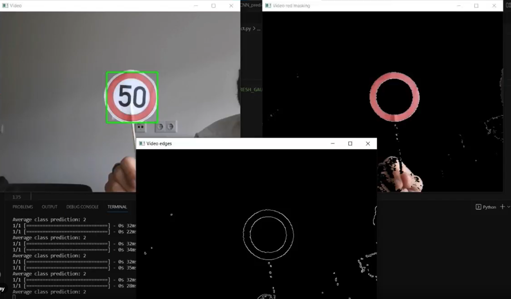

# 🚦 Speed Sign Recognition using CNN 🚗



## 👋 Overview

This project implements a Convolutional Neural Network (CNN) to recognize German Traffic Signs (GTSRB dataset).  
It includes two main scripts:

- `CNN_training.py`: trains the CNN model on the GTSRB dataset and saves the trained model.
- `predict.py`: loads the trained model, accesses your webcam, detects and classifies speed limit signs in real-time.

---

## ✨ Features

- CNN architecture optimized for traffic sign classification.
- Real-time prediction from webcam feed.
- Image preprocessing including color masking and contour detection.
- Model saving and loading using Keras `.keras` format.

---

## 🛠️ Setup and Installation

### Prerequisites

- Python 3.8+
- pip

### Install dependencies

```bash
pip install -r requirements.txt
```
### Requirements
```bash
tensorflow
keras
numpy
opencv-python
pandas
```

## ▶️ Usage

### Training the model
Run the trianing script to train the CNN and save the model:

```bash
python CNN_training.py
```

### Running predictions
Run the prediction script to access your webcam and classify traffic signs:

```bash
python predict.py
```

- Hold up speed limit signs to the camera.

- Press b to quit the webcam window.

## 📂 File structure
```bash
├── CNN_training.py        # Training script
├── predict.py             # Prediction script using webcam
├── GTSRB                  # Dataset folder with images and CSV files
├── CNN_model.keras        # Saved Keras model file
├── requirements.txt       # Python dependencies
├── README.md              # This file
├── Paper_1.pdf            # Reference 1
└── Paper_2.pdf            # Reference 2
└──thumbnail.png           # Thumbnail
```

## ⚠️ Notes
- Ensure the GTSRB dataset folder is correctly placed relative to the scripts.

- The model expects input images resized to 30x30 pixels.

- For better results, use printed traffic signs or clear images.


- The trained model is saved as `CNN_model.keras` in the repository and is used for prediction and further training.

- There might be a `CNN_model/` folder generated if you save the model in TensorFlow's SavedModel format. This folder is **not included** in the repo   as it contains multiple files and is not required for running the current scripts.


## 📚 Research References
This project is inspired and supported by the following research papers included in the repository for your reference:

1. A Fast and Effective Ellipse Detector for Embedded Vision Applications
    📝 An efficient method for detecting elliptical shapes, which is relevant for identifying circular traffic signs in real-time systems.

2. Traffic Sign Detection and Recognition Using Adaptive Threshold Segmentation with Fuzzy Neural Network Classification
    📝 A comprehensive approach combining adaptive image segmentation and fuzzy neural networks for accurate traffic sign recognition.

## Contributions 🤝
The project was developed in partenership with Neofytos Dionysiou
📬 Email: fytsfyts97@live.com

## 📄 License
This project is open source and available under the MIT License.

### 🙋‍♂️ Author
Anurakt Raj Mathur
💼 [LinkedIn](https://www.linkedin.com/in/anurakt-raj-mathur)
📬 Email: anuraktrajmathur@gmail.com
